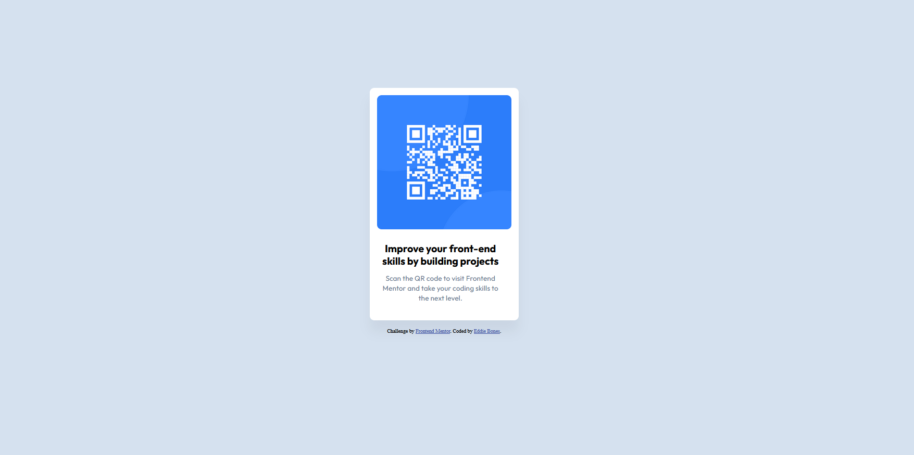
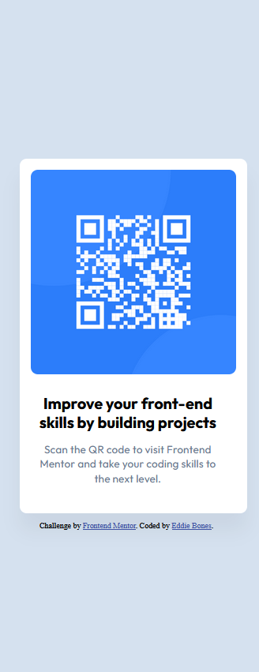

# Frontend Mentor - QR code component solution

This is a solution to the [QR code component challenge on Frontend Mentor](https://www.frontendmentor.io/challenges/qr-code-component-iux_sIO_H). Frontend Mentor challenges help you improve your coding skills by building realistic projects. 

## Table of contents

- [Overview](#overview)
  - [Screenshot](#screenshot)
  - [Links](#links)
- [My process](#my-process)
  - [Built with](#built-with)
  - [What I learned](#what-i-learned)
  - [Continued development](#continued-development)
  - [Useful resources](#useful-resources)
- [Author](#author)


## Overview

### Screenshot
**Desktop Version**



**Mobile Version**




### Links

- Solution URL: https://www.frontendmentor.io/solutions/qr-code-component-uHmulfTD1B
- Live Site URL: https://eddiebones1.github.io/QR-Code-Component/
## My process

### Built with

- Semantic HTML5 markup
- CSS custom properties


### What I learned

While working on this project, I learned the collaborative process between a Web Designer and a Front-End Developer, and how they supply the developer with the specs such as typograhy, colors, and images in order to perform the task. As for the coding aspect, I learned how to install custom Google Fonts. Also, I learned that is better to use "rem" over "px" because "rem" makes sites more accessible by making the font more reponsive. 

To see how you can add code snippets, see below:

```html
<link rel="preconnect" href="https://fonts.googleapis.com">
<link rel="preconnect" href="https://fonts.gstatic.com" crossorigin>
<link href="https://fonts.googleapis.com/css2?family=Outfit:wght@100..900&display=swap" rel="stylesheet">
```
```css
p {
  font-family: "Outfit", sans-serif;
  font-weight: 400; /* Regular font weight*/
  color: #68778d;
  text-align: center;
  font-size: 0.9375rem;
  line-height: 140%;
  margin-left: 1.5rem;
  width: 16rem;
  height: 3.9375rem;
  letter-spacing: 0.0125rem;
}
```

### Continued development

At first, I was having a difficult time centering the QR code and the attribution in the center of the page. Until, I found a Youtube video by Kevin Powell in which he explains the different Position Properties, and how to use it effectively. 


### Useful resources

- [Coder Coder - px vs rem](https://www.youtube.com/watch?v=dHbYcAncAgQ) - In Coder Coder's Youtube video, they taught me the importance of using rem units over px when it comes to font-sizing. 
- [Kevin Powell - Position Deep Dive](https://www.youtube.com/watch?v=fF_NVrd1s14) - This is an Youtube video by Kevin Powell, in which he talks about the different position properties in CSS, and he gives you examples of each property.


## Author

- Website - [Add your name here](https://www.your-site.com)
- Frontend Mentor - [@EddieBones1](https://www.frontendmentor.io/profile/EddieBones1)
- Twitter - [@yourusername](https://www.twitter.com/yourusername)
